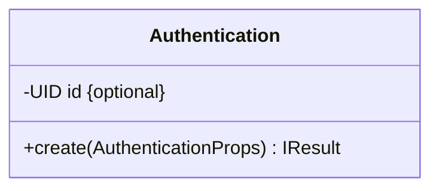

# Domain model Uml

To be able to write better domain it s recommend to define bounded context of the system.  

With the power of mermaid.js you can write easily diagram.  
[Mermaid.js Documentation](https://mermaid-js.github.io/mermaid/#/)

All bounded context should be written in this folder.  
e.g:

# Authentication
